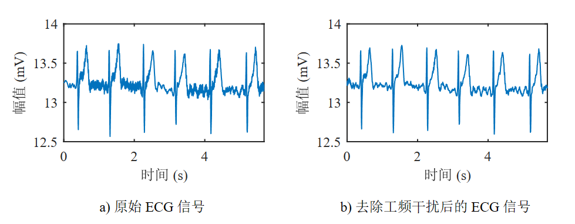
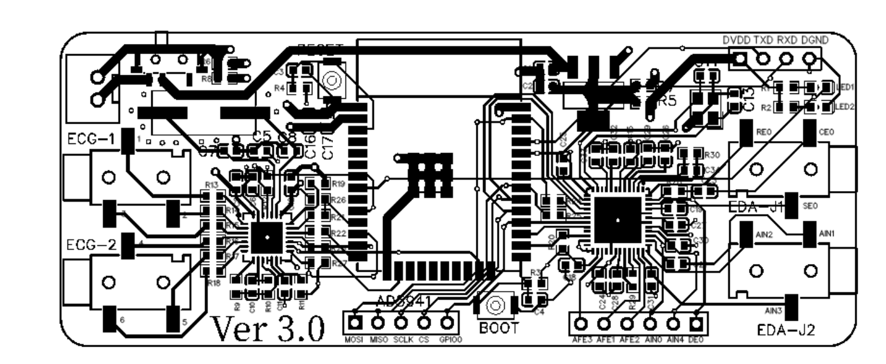
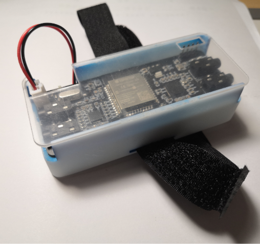

# ESP32 Biosignal Monitor

This project is a physiological signal acquisition system developed using ESP32-­WROOM-­32E, ADS1293, and AD5941. It is designed to collect various physiological signals, such as electrocardiograms (ECG) and electrodermal activity (EDA), and transmit them wirelessly using websockets. It also can calculate the heart rate by extracting the R peaks from the ECG signal. It employed notch filters and wavelet filters for ECG signal denoising. 

## Introduction
### ECG Signal Denoising

### Heart Rate Extraction

### Schematic Diagram

### Circuit Diagram

### Shell Design

### Physical Prototype

## Usage

## Acknowledgements
This project makes use of the following open-source libraries:

+ [esp32-websocket](https://github.com/Molorius/esp32-websocket) - A WebSocket library for the ESP32, enabling efficient real-time communication for IoT devices. This library forms the backbone of our system's wireless data transmission capabilities.
+ [wavelib](https://github.com/rafat/wavelib) - A Wavelet Transform library that provides various signal processing functions that help denoise the physiological signals collected by our system.

Special thanks to the authors and contributors of these projects for their valuable work, which significantly enhanced the functionality and performance of our physiological signal acquisition system.
